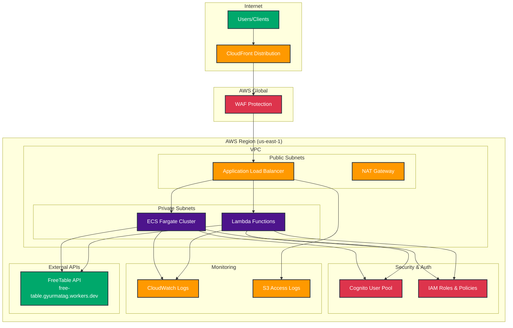
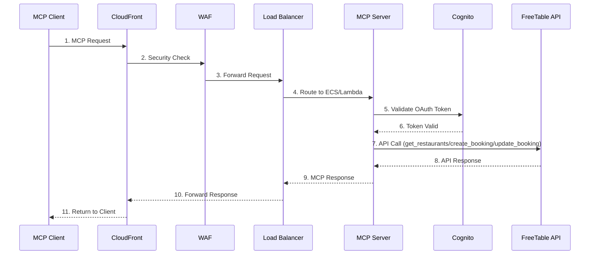

# FreeTable Remote MCP Server on AWS

A Model Context Protocol (MCP) server for restaurant booking management deployed on AWS infrastructure. This project provides both ECS Fargate and Lambda deployment options with secure OAuth 2.0 authentication.

## 🏗️ Architecture



### Architecture Components

- **VPC Stack**: Virtual Private Cloud with public/private subnets
- **Security Stack**: Cognito User Pool, WAF rules, and IAM roles  
- **CloudFront-WAF Stack**: Global content delivery with security
- **MCP Server Stack**: ECS Fargate and Lambda MCP servers

### Data Flow



### Security Layers

1. **CloudFront**: Global CDN with DDoS protection
2. **WAF**: Web Application Firewall with rate limiting
3. **VPC**: Network isolation and security groups
4. **Cognito**: OAuth 2.0 authentication and authorization
5. **IAM**: Least privilege access control

## 🚀 Features

### MCP Server Tools

1. **`get_restaurants`** - Get list of available restaurants
2. **`create_booking`** - Create a restaurant booking
3. **`update_booking`** - Update an existing restaurant booking

### Security Features

- OAuth 2.0 Protected Resource Metadata (RFC9728)
- AWS WAF protection
- VPC isolation
- IAM least privilege access
- JWT token validation

## 📋 Prerequisites

- AWS CLI (v2.0+)
- Node.js (v14+)
- AWS CDK (v2.0+)
- Docker

## 🚀 Quick Start

1. **Clone the repository**
   ```bash
   git clone https://github.com/yourusername/free-table-remote-mcp-aws.git
   cd free-table-remote-mcp-aws
   ```

2. **Install dependencies**
   ```bash
   cd guidance-for-deploying-model-context-protocol-servers-on-aws/source/cdk/ecs-and-lambda
   npm install
   ```

3. **Deploy to AWS**
   ```bash
   # Login to ECR
   aws ecr-public get-login-password --region us-east-1 | docker login --username AWS --password-stdin public.ecr.aws
   
   # Deploy all stacks
   npx cdk deploy --all --require-approval never
   ```

4. **Test the deployment**
   ```bash
   # Get CloudFront URL
   CLOUDFRONT_URL=$(aws cloudformation describe-stacks \
     --stack-name MCP-Server \
     --query 'Stacks[0].Outputs[?OutputKey==`CloudFrontDistributions`].OutputValue' \
     --output text)
   
   # Test health endpoints
   curl "https://$CLOUDFRONT_URL/restaurant-booking/"
   curl "https://$CLOUDFRONT_URL/restaurant-booking-lambda/"
   ```

## 📚 Documentation

- **[Complete Deployment Guide](RESTAURANT_MCP_DEPLOYMENT_GUIDE.md)** - Detailed step-by-step instructions
- **[AWS Architecture Guide](guidance-for-deploying-model-context-protocol-servers-on-aws/README.md)** - Original AWS guidance

## 🛠️ Development

### Project Structure

```
free-table-remote-mcp-aws/
├── guidance-for-deploying-model-context-protocol-servers-on-aws/
│   └── source/cdk/ecs-and-lambda/
│       ├── servers/
│       │   ├── sample-ecs-weather-streamablehttp-stateless-nodejs-express/
│       │   └── sample-lambda-weather-streamablehttp-stateless-nodejs-express/
│       ├── lib/
│       └── bin/
├── RESTAURANT_MCP_DEPLOYMENT_GUIDE.md
└── README.md
```

### MCP Server Implementation

The MCP servers are implemented in TypeScript using the `@modelcontextprotocol/sdk` and integrate with the FreeTable API:

- **Base URL**: `https://free-table.gyurmatag.workers.dev`
- **Transport**: StreamableHTTP
- **Authentication**: OAuth 2.0 with Cognito

## 🔧 Configuration

### Environment Variables

```bash
AWS_REGION=us-east-1
COGNITO_USER_POOL_ID=<from CloudFormation output>
COGNITO_USER_POOL_CLIENT_ID=<from CloudFormation output>
BASE_URL=https://<cloudfront-domain>
```

### FreeTable API Integration

The servers integrate with the FreeTable API endpoints:
- `GET /api/restaurants` - List restaurants
- `POST /api/bookings` - Create booking  
- `PUT /api/bookings/{id}` - Update booking

## 💰 Cost Estimation

**Monthly costs (US East 1):**
- VPC (NAT Gateway): ~$37.35
- Application Load Balancer: ~$16.83
- CloudFront: ~$87.96
- WAF: ~$10.00
- ECS Fargate: ~$36.04
- Lambda: ~$0.20
- **Total**: ~$194.18/month

## 🧹 Cleanup

```bash
# Destroy all stacks
npx cdk destroy --all --force
```

## 📄 License

This project is licensed under the MIT License - see the [LICENSE](LICENSE) file for details.

## 🤝 Contributing

1. Fork the repository
2. Create a feature branch (`git checkout -b feature/amazing-feature`)
3. Commit your changes (`git commit -m 'Add some amazing feature'`)
4. Push to the branch (`git push origin feature/amazing-feature`)
5. Open a Pull Request

## 📞 Support

- Check the [deployment guide](RESTAURANT_MCP_DEPLOYMENT_GUIDE.md) for troubleshooting
- Review CloudFormation events for deployment issues
- Check CloudWatch logs for runtime errors

## 🔗 Related Links

- [Model Context Protocol](https://modelcontextprotocol.io/)
- [AWS CDK Documentation](https://docs.aws.amazon.com/cdk/)
- [FreeTable API](https://free-table.gyurmatag.workers.dev)
